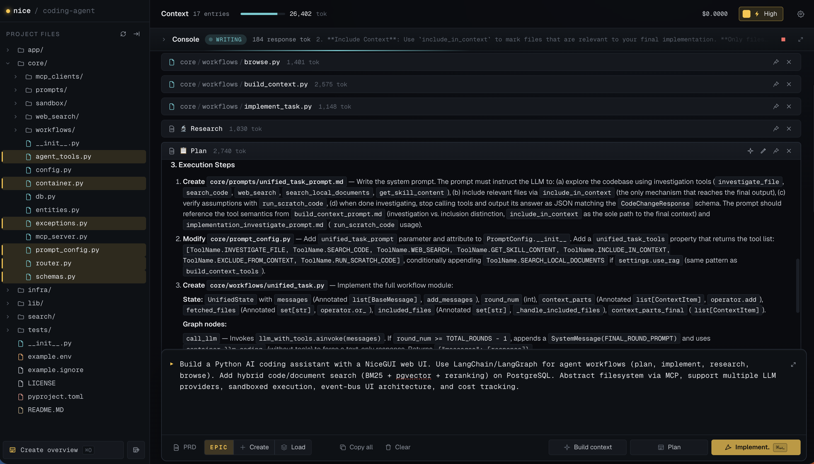

# Nice Coding Agent

An AI-powered development assistant that helps you understand, plan, implement, research, and document code in your own projects — all through a clean web UI. It's human-in-the-loop by design, putting control back in your hands: you see and approve every plan, search, and change, with hybrid code retrieval, research, web automation, and safe code execution built in.



## What It Is

Nice Coding Agent runs LLM agent workflows over your local project. It can read and write your filesystem, search your code and documents with hybrid retrieval, run sandboxed code, and browse the web — driven from a single-page NiceGUI interface with live streaming and per-session cost tracking.

It gives you dedicated, on-demand workflows:

- **Build context** — assembles an implementation-ready brief from your codebase.
- **Plan** — produces a structured implementation plan you can review and edit.
- **Implement** — turns a plan into proposed code changes.
- **Research** — answers questions using your code, your docs, and the web.
- **Inspect** — drives a real browser (via Playwright) to examine a live web page: open a running app, debug why a button doesn't respond, or extract content from a page.
- **Browse** — explores the web for external context.

It's built in Python with [NiceGUI](https://nicegui.io/) for the frontend and LangChain/LangGraph for agent orchestration.

## What It Is Not

- **Not a fully autonomous agent.** You drive it. Each workflow runs when you trigger it and stops with output for you to review — it doesn't run open-ended loops on its own.
- **It doesn't auto-change your code.** Implementation produces proposed changes that you decide whether to apply. Nothing is written to your project behind your back.

## Getting Started

### Requirements

- [uv](https://docs.astral.sh/uv/) — for running the app
- [Docker](https://docs.docker.com/get-docker/) — for the PostgreSQL database

**LLM API:** Defaults to the free NVIDIA API (40 RPM) — get a key at [build.nvidia.com](https://build.nvidia.com). Open the app's configuration to see other supported providers (OpenAI-compatible, OpenRouter, Gemini, Kimi, Mimo).

**Optional:**
- **Sandboxed code execution (Linux):** bubblewrap (`bwrap`) on `PATH` — `sudo apt install bubblewrap` (Debian/Ubuntu) or `sudo dnf install bubblewrap` (Fedora/RHEL).
- **Live page inspection:** `npx playwright install chrome`
- **Web search:** an [Exa](https://exa.ai/) API key — get one at [dashboard.exa.ai/api-keys](https://dashboard.exa.ai/api-keys)

### Start in Two Commands

**1. Start the database** (pre-built PostgreSQL image with ParadeDB + pgvector for hybrid search):

```bash
docker run -d --name agent_postgres -p 5432:5432 -v agent_pgdata:/var/lib/postgresql --shm-size=1g ghcr.io/arsicd/nice_parade:latest
```

**2. Run the app:**

```bash
uvx --from git+https://github.com/arsicd/nice_coding_agent agent
```

The web UI opens in your browser once the app starts.

### Stopping and Restarting

The database keeps running in the background. Stop it with `docker stop agent_postgres`, and start it again later with `docker start agent_postgres` — your data is preserved in the `agent_pgdata` volume.

## Features

- **Conversational web UI** — interact with agent workflows from a single-page NiceGUI interface, with live streaming of model output and per-session cost tracking.
- **Agent workflows** — dedicated flows for planning, implementing, researching, browsing, and building context, each a LangGraph state machine running multi-round LLM conversations with tool calls.
- **Hybrid code & document search** — BM25 full-text + pgvector ANN retrieval with cross-encoder reranking, backed by PostgreSQL (ParadeDB + pgvector).
- **Filesystem access** — read, write, list, and edit files in your project, with gitignore-aware filtering. Supports both local I/O and JetBrains IDE integration over MCP.
- **Sandboxed execution** — agent-generated code runs in an isolated macOS and Linux sandbox for safe verification (Docker backend planned).
- **Pluggable LLM providers** — OpenAI-compatible, OpenRouter, Gemini, Kimi, Mimo. Toggle between "standard" and "high" model tiers for cost-vs-quality control.
- **Live page inspection** — drives a real browser via Playwright to inspect running web pages: open a local or staging app, debug unresponsive UI, or extract content from a live page.
- **Web research** — external web search via the Exa API.

## How It Works

The UI follows a Presenter–Controller–State pattern coordinated by an async event bus, which is the sole channel between the interface and application logic. User actions flow through a core router into LangGraph agent workflows. All LLM calls are routed through a central agent container for consistent model selection, streaming, and cost tracking, and all filesystem changes are proxied through an MCP client rather than written directly.

Under the workflows sit two main subsystems: an LLM container managing model instances and provider abstraction, and a hybrid search engine combining BM25, vector search, and reranking over PostgreSQL.

For a deeper technical breakdown, see the [project overview](.nice/project_overview.md) document.

## Tech Stack

- **Frontend:** NiceGUI (FastAPI + Vue/Quasar)
- **Orchestration:** LangChain / LangGraph
- **Database:** PostgreSQL with ParadeDB extensions + pgvector (Alembic migrations)
- **Embeddings & reranking:** sentence-transformers (Jina Code, Nomic) and mxbai-rerank / Jina
- **Code parsing:** Tree-sitter (Python, JavaScript, TypeScript, Go)
- **Web search:** Exa API

## MCP Tools

This project exposes an MCP server (`nicegui-tools`) over SSE that gives Claude (or any MCP client) three retrieval tools scoped to your repo and documents. The tools are indexed against the codebase, so they stay aware of your actual source rather than relying on the model's guesses.

### Tools

| Tool | What it does | When to use |
|------|--------------|-------------|
| `search_code` | Hybrid search (vector + lexical, cross-encoder reranked) over indexed source code. Returns ranked chunks with file path and score. | Default tool for orienting in the codebase. Mix natural language with literal tokens (function names, error strings). Chain several calls to triangulate. |
| `search_documents` | Hybrid search over reference docs in `documents/` (PDF/MD/TXT/DOCX). Returns matching chunks with source filename and score. | Questions answerable from your specs, design docs, manuals, or notes — intent and requirements rather than implementation. |
| `build_comprehensive_context` | Background research agent that returns an implementation-ready brief: full file contents, project conventions, and likely gotchas. | Large, multi-module changes where orchestrating searches yourself would take many turns. Slow (15–60s) and token-heavy. |

> `search_documents` only appears when RAG is enabled (`use_rag` in settings).

### Setup

1. **Index the project.** Code is indexed lazily on the first `search_code` call, but you can warm it ahead of time. Document indexing requires `use_rag` to be enabled and files placed in `documents/`.
2. **Run the MCP server.** It is served over SSE at the `/mcp/messages` endpoint as part of the app.
3. **Connect your client.** Point your MCP client (e.g. Claude Desktop or the CLI) at the SSE endpoint. Once connected, the tools appear automatically.

### Suggested `CLAUDE.md`

To get the most out of these tools, add a `CLAUDE.md` to your repo telling the model how to use them. A good starting point:

```markdown
# Codebase Exploration Protocol

Project overview lives in `.nice/project_overview.md` — read it first.

Three MCP tools are indexed against this repo:

- **`search_code`** — hybrid search over source code. Mix natural language with
  literal tokens (function names, error strings). Default tool for orienting;
  chain multiple calls to triangulate.
- **`search_documents`** — hybrid search over reference docs in `documents/`
  (specs, design docs, manuals). Use for intent and requirements, not implementation.
- **`build_comprehensive_context`** — background research agent. Returns full files
  + conventions for the task. Slow (15–60s) and token-heavy. Reserve for large
  multi-module changes. `task_prompt` is read without conversation context — write
  it self-contained.

Default to `search_code`. Reach for `build_comprehensive_context` only when the
scope is genuinely too large to orchestrate.
```

## License

See the LICENSE file in this repository.